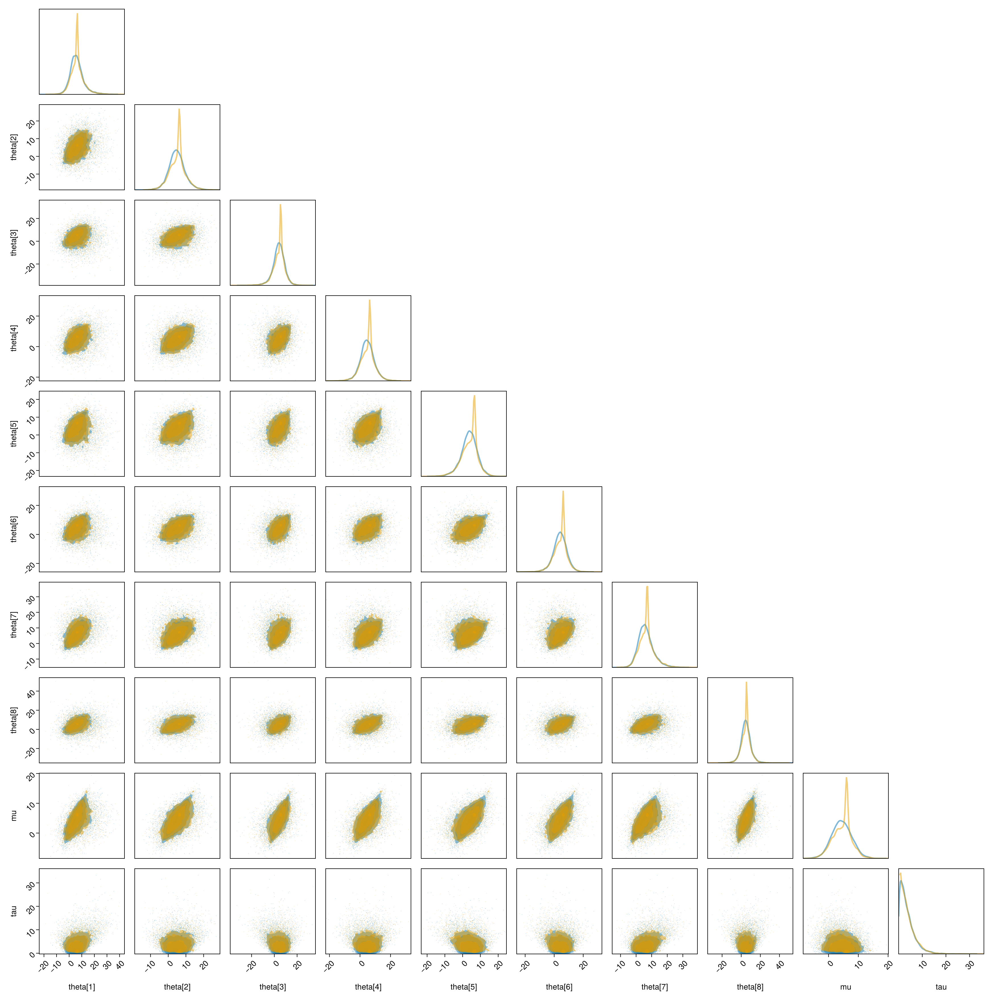

# PosteriorDBTests

The idea behind this was to get a quick interface to PosteriorDB (via `PosteriorDB.jl`). The ideal for this
is something like

```julia
get_turing_draws("eight_schools-eight_schools_centered", eight_schools_centered; sampler = NUTS(), samples = 10000)
```

Where `eight_schools_centered` is a Turing model, and `"eight_schools-eight_schools_centered"` is the identifier for the 
model we wish to compare the Turing model against. This does a couple of things --- most importantly, it fetches the relevant dataset
from PDB (using PDB.jl) and samples the model with a defaul setup that approximately matches Stan. 

In practice I also need to specify the data names that Stan uses:

```julia
get_turing_draws("eight_schools-eight_schools_centered", eight_schools_centered, ["J", "y", "sigma"])
```

Because I can't think of a quick way to grab these from just the ID (they aren't currently in the "model card" json file, though there's an issue open suggesting they be added).

This syntax mirrors the way we can grab PDB draws:

```julia
get_reference_draws("eight_schools-eight_schools_centered")
```
whch gets the corresponding reference posterior. We can then, for example, plot the pairs plot:

```julia
pairplot(df_ref, df_turing)
```

